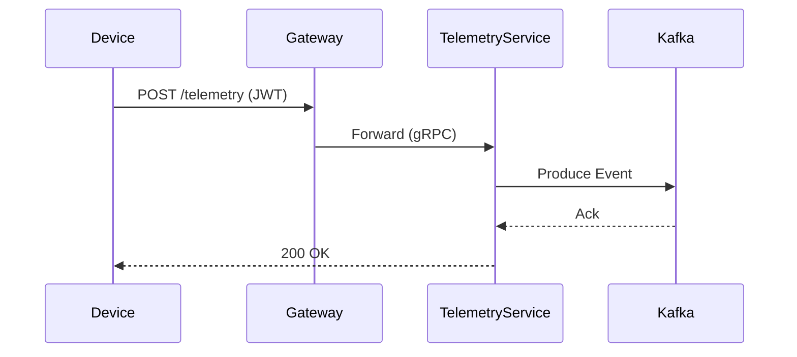

# Sequence Diagrams

## Telemetry Ingestion

```mermaid
sequenceDiagram
    participant Device
    participant Gateway
    participant TelemetryService
    participant Kafka

    Device->>Gateway: POST /telemetry (JWT)
    Gateway->>TelemetryService: Forward (gRPC)
    TelemetryService->>Kafka: Produce Event
    Kafka-->>TelemetryService: Ack
    TelemetryService-->>Device: 200 OK
```
